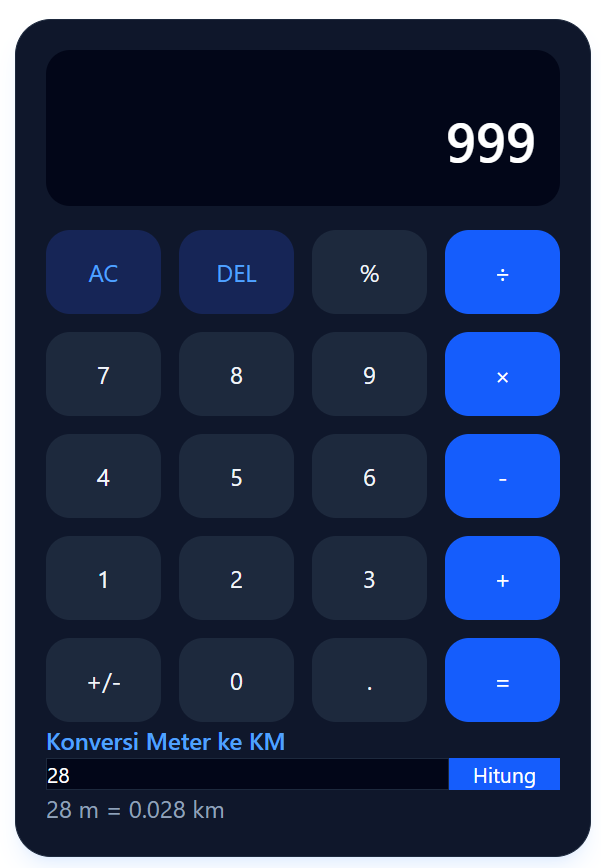

# Aplikasi Kalkulator

Proyek kolaborasi tim KodeKita Studio — Simulasi Tim Developer, RPL Kelas XI.

# Deskripsi

Aplikasi kalkulator sederhana yang mendukung operasi hitung dasar (tambah, kurang, kali, bagi). Dibangun sebagai simulasi proyek klien menggunakan alur kerja kolaborasi Git & GitHub ala industri IT.

# Anggota Tim & Peran
| Nama | Peran |
| --- | --- |
| Xaviero | Project Manager (PM) |
| Irsyam | Front-End Developer |
| Rafi | Back-End Developer |
| Revan | UI/UX & Dokumentasi |
| Azri | QA / Tester |         

## Bahasa & Teknologi yang Digunakan

- **HTML** - Untuk membuat struktur antarmuka web.
- **JavaScript** - Untuk logika perhitungan kalkulator dan manipulasi DOM.
- **Tailwind CSS** - Untuk *styling* antarmuka tampilan UI.

---

## Cara Menjalankan Aplikasi

### Cara 1: Menggunakan Live Server di VS Code (Direkomendasikan)
1. Buka folder `view` di explorer VS Code.
2. Klik file `index.html`.
3. Klik tombol **Go Live** di pojok kanan bawah jendela VS Code.
4. Aplikasi akan otomatis berjalan di browser kamu.

### Cara 2: Membuka File Langsung
1. Buka folder proyek `Project-Calculator` di File Explorer komputer kamu.
2. Masuk ke dalam folder `view`.
3. Klik dua kali pada file `index.html` untuk membukanya di Google Chrome atau browser lainnya.

# Masuk ke folder proyek
cd [nama-folder]

# Kalau pakai HTML/CSS/JS -> buka index.html di browser

# Daftar Tugas Tim
| No | Tugas | PIC | Status |
|---|---|---|---|
| 1 | Kalkulator dasar (+, -, ×, ÷) | FrontEnd | Done |
| 2 | Tampilan UI | UI/UX | Done |
| 3 | Dokumentasi (README) | Nama | In Progress |
| 4 | Testing | QA | In Progress |

